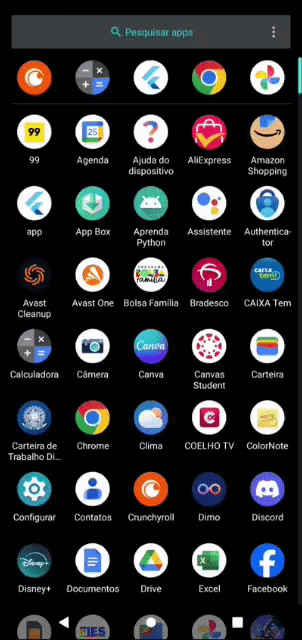
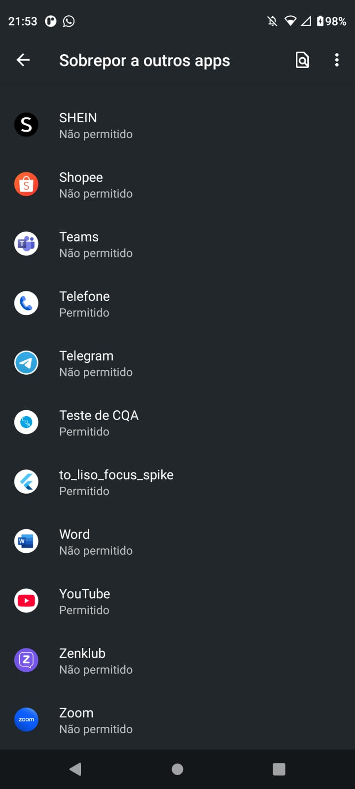
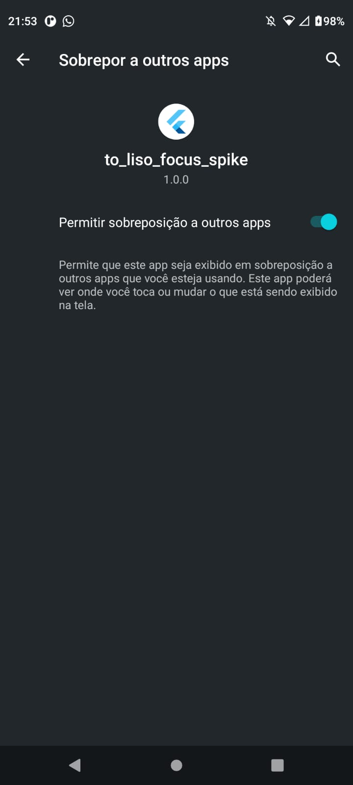
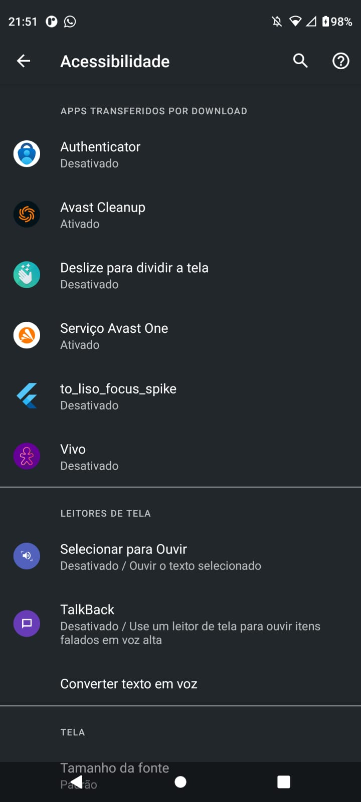
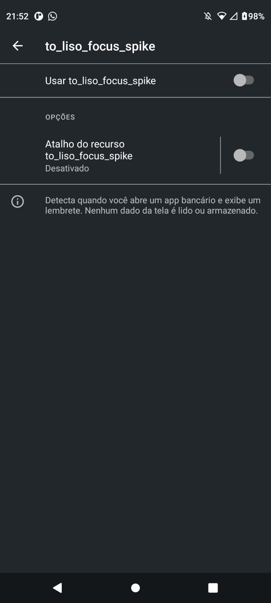
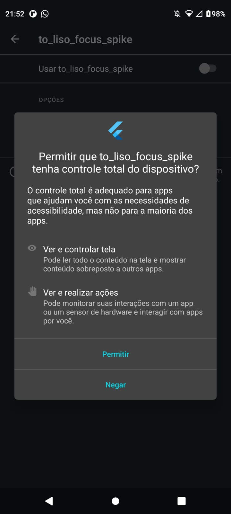
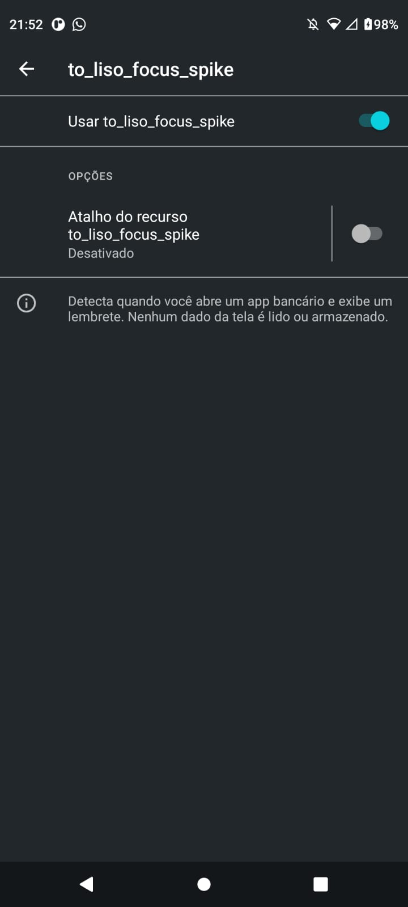

# 🧠 Tô Liso? — Focus Mode Spike


> **Hipótese:** É possível interceptar a abertura de apps financeiros no Android
> e exibir um overlay de intervenção comportamental de forma estável,
> usando apenas `AccessibilityService` e `WindowManager`?
>
> **Resultado:** ✅ Sim — validado em dispositivo físico (Moto G 5G, Android 13).

---

## Demonstração

<div align="center">
  
</div>

---

## Contexto

O **[Tô Liso?](https://github.com/argemiroanjos)** é um app de controle financeiro
comportamental. O diferencial do produto não é registrar gastos depois que o dinheiro
foi embora — é intervir **antes** que o gasto aconteça.

Uma das features mais críticas do roadmap é o **Modo Foco Financeiro**: quando o
usuário abre um app bancário, o Lisinho aparece e pergunta se aquilo é impulso ou
necessidade.

Antes de comprometer semanas de desenvolvimento nessa feature, precisávamos
responder uma pergunta objetiva: **o Android deixa fazer isso de forma confiável?**

Esse repositório é a resposta.

---

## O que foi validado

| Funcionalidade | Meta | Resultado |
|---|---|---|
| Detectar app em foreground | < 1 segundo | ✅ ~300–500ms |
| Overlay aparecer sobre o app monitorado | Funcional | ✅ Confirmado |
| Overlay resistir a transições do launcher | Sem flickering | ✅ Confirmado |
| Botão "Analisar" funcional | Registra intenção | ✅ Confirmado |
| Botão "Liberar" funcional | Fecha sem crash | ✅ Confirmado |
| Debounce de eventos duplicados | Sem re-triggers | ✅ Confirmado |
| Cooldown pós-dispensa | Evita loop | ✅ Confirmado |
| **Dispositivo real** | Motorola (Android 13) | ✅ Moto G 5G |

---

## Por que esse spike foi necessário

O `AccessibilityService` é a única API Android que permite detectar qual app está
em foreground sem root. O problema é que ela é conhecida por:

- disparar eventos de forma inconsistente entre fabricantes
- ser morta por otimização de bateria em ROM customizadas (Samsung OneUI, MIUI)
- exigir justificativa escrita para aprovação na Play Store
- ter comportamentos não documentados que só aparecem em dispositivo físico

Nenhum emulador reproduz esses problemas com fidelidade. Por isso o spike foi
executado diretamente no hardware antes de qualquer linha de código do produto.

---

## Decisões técnicas

### Por que `TYPE_WINDOW_STATE_CHANGED` e não `UsageStatsManager`

O documento original do spike previa as duas APIs. Durante a implementação,
confirmamos que `AccessibilityEvent.TYPE_WINDOW_STATE_CHANGED` entrega o
`packageName` do app em foreground diretamente — sem precisar de `UsageStatsManager`.

Isso importa porque `UsageStatsManager` exige a permissão `PACKAGE_USAGE_STATS`,
que é elevada, difícil de justificar na Play Store e invisível no popup padrão
do Android (exige ativação manual em Configurações → Acesso especial). Eliminar
essa permissão reduz atrito com o usuário e risco de rejeição na store.

### Por que máquina de estados em vez de flag booleano

Durante os primeiros testes, o overlay aparecia e desaparecia em ~300ms.
A causa: o launcher do sistema dispara `TYPE_WINDOW_STATE_CHANGED` brevemente
durante qualquer transição de janela. Sem controle de estado, um `if/else`
simples reage a isso e derruba o overlay.

A solução foi uma máquina de dois estados:

```
IDLE ──(app monitorado detectado)──► OVERLAY_ACTIVE
OVERLAY_ACTIVE ──(usuário decide)──► IDLE
```

No estado `OVERLAY_ACTIVE`, **todos** os eventos de janela são ignorados.
O overlay só fecha por ação explícita do usuário — nunca por evento do sistema.

### Por que cooldown contextual e não cooldown por tempo fixo

A primeira versão usava `releaseCooldownMs = 5000L` fixo. O problema:
se o usuário dispensava o overlay, saía do app bancário e voltava, o cooldown
ainda estava ativo — comportamento errado. Aquele retorno é um novo momento
de decisão e merecia um novo overlay.

A solução foi amarrar o cooldown ao contexto: ele se reseta automaticamente
quando o app monitorado sai do foreground. O cooldown só persiste se o usuário
continuar no mesmo app após a dispensa.

### Por que overlay nativo (XML) e não overlay Flutter

Para o produto final, o overlay será renderizado pelo Flutter para manter
consistência com o Design System. Para o spike, usar XML nativo elimina uma
variável do experimento — se algo der errado, sabemos que é o mecanismo do
`AccessibilityService`, não a integração com o Flutter Engine.

---

## Problemas encontrados e soluções

### 1. Loop infinito de eventos

**Sintoma:** overlay aparecia, sumia e reaparecia em loop contínuo.

**Causa raiz:** `onAccessibilityEvent` processava **todos** os tipos de evento
(cliques, scroll, foco de view) como se fossem mudanças de foreground.
O próprio overlay disparava eventos, que disparavam mais overlays.

**Fix — primeira linha do handler:**
```kotlin
if (event.eventType != AccessibilityEvent.TYPE_WINDOW_STATE_CHANGED) return
```

Essa linha sozinha eliminou ~90% dos bugs de comportamento.

---

### 2. Launcher derrubando o overlay

**Sintoma:** overlay aparecia corretamente mas sumia após ~300ms.

**Causa:** durante a abertura do overlay, o Android registra brevemente
`com.motorola.launcher3` como foreground. Sem tratamento, isso disparava `hide()`.

**Evidência nos logs antes do fix:**
```
Foreground detectado: com.google.android.calculator → Overlay exibido
Foreground detectado: com.motorola.launcher3        → Overlay removido  ← bug
```

**Fix:** estado `OVERLAY_ACTIVE` que ignora transições enquanto overlay está visível.

**Evidência nos logs após o fix:**
```
Evento: com.motorola.launcher3 | estado: OVERLAY_ACTIVE
Overlay ativo — transição ignorada: com.motorola.launcher3  ← correto
```

---

### 3. `ClassNotFoundException` no AccessibilityService

**Sintoma:** crash na inicialização. Serviço não aparecia nas configurações
de acessibilidade do Android.

**Causa:** o `<service>` estava ausente do `AndroidManifest.xml`.
O Android não conhece a existência de um serviço que não está declarado no manifest,
independente do código Kotlin estar correto.

**Fix:** adicionar ao manifest:
```xml
<service
    android:name=".FocusAccessibilityService"
    android:permission="android.permission.BIND_ACCESSIBILITY_SERVICE"
    android:exported="true">
    <intent-filter>
        <action android:name="android.accessibilityservice.AccessibilityService" />
    </intent-filter>
    <meta-data
        android:name="android.accessibilityservice"
        android:resource="@xml/accessibility_config" />
</service>
```

---

### 4. Re-trigger imediato após dispensa

**Sintoma:** ao tocar em "Liberar", o overlay fechava e reaparecia imediatamente.

**Causa:** o evento `TYPE_WINDOW_STATE_CHANGED` disparava novamente para o
mesmo app logo após o overlay ser removido.

**Fix:** cooldown contextual com reset automático quando o app sai do foreground.

---

## Limitações conhecidas

Este spike valida o mecanismo. **Não valida:**

| Limitação | Impacto | Próximo passo |
|---|---|---|
| Testado apenas em Motorola | Samsung/Xiaomi têm camadas de kill agressivas | Testar Samsung Galaxy e Xiaomi antes do lançamento |
| Aprovação Play Store não garantida | Accessibility Service exige declaração de uso | Redigir justificativa + gravar vídeo de demonstração |
| Battery optimization pode matar o serviço | Em modo economia, o serviço pode ser encerrado | Guiar usuário para whitelist do app nas configurações |
| iOS: não há equivalente | Accessibility Service não está disponível para terceiros | Solução alternativa via Shortcuts (manual, sem automação) |
| Sem testes de longevidade | Comportamento após 30min+ de serviço ativo é desconhecido | Teste de bateria e estabilidade em ciclo completo |

---

## Arquitetura

```
┌─────────────────────────────────────────────────────────┐
│                    Flutter (Dart)                        │
│                                                          │
│  HomeScreen                                              │
│  ├── Status das permissões                               │
│  ├── Botão → Acessibilidade (settings do sistema)        │
│  └── Botão → Overlay permission (settings do sistema)    │
│                    │                                     │
│            MethodChannel                                 │
│         "com.spike.foco/settings"                        │
└────────────────────┬────────────────────────────────────┘
                     │
┌────────────────────▼────────────────────────────────────┐
│                  Kotlin (Android)                        │
│                                                          │
│  MainActivity.kt                                         │
│  └── Recebe chamadas do Flutter e abre system settings   │
│                                                          │
│  FocusAccessibilityService.kt                            │
│  ├── onAccessibilityEvent()                              │
│  │     └── Filtro: TYPE_WINDOW_STATE_CHANGED             │
│  ├── Handler debounce (300ms)                            │
│  ├── Estado: IDLE | OVERLAY_ACTIVE                       │
│  └── Cooldown contextual pós-dispensa                    │
│                                                          │
│  OverlayManager.kt                                       │
│  ├── WindowManager.addView()                             │
│  ├── TYPE_APPLICATION_OVERLAY (API 26+)                  │
│  ├── MATCH_PARENT — full screen                          │
│  ├── Sem FLAG_NOT_TOUCH_MODAL → captura todos os toques  │
│  └── Callbacks: onAnalyze | onRelease                    │
└─────────────────────────────────────────────────────────┘
```

---

## Setup

### Pré-requisitos

- Flutter `>= 3.11.0`
- Android SDK `API 26+` (Android 8.0 Oreo)
- **Dispositivo físico recomendado** — emuladores têm comportamento inconsistente
  com `AccessibilityService`

### Instalação

```bash
git clone git@github.com:argemiroanjos/to-liso-focus-spike.git
cd to-liso-focus-spike
flutter pub get
flutter run
```

### Configuração de permissões (ordem importa)

**Passo 1 — Permissão de overlay**

```
Configurações → Apps → Acesso especial → Exibir sobre outros apps
→ To Liso Focus Spike → Ativar
```

<div align="center">
  
  
</div>

**Passo 2 — Ativar Accessibility Service**

```
Configurações → Acessibilidade → Serviços instalados
→ To Liso Focus Spike → Usar serviço → Ativar
```

<div align="center">
  
  
  
  
</div>

> ⚠️ As duas permissões são necessárias. O app verifica o status de cada uma
> na tela principal e indica qual está faltando.

---

### Apps monitorados (para teste)

```kotlin
private val monitoredApps = setOf(
    "com.google.android.calculator", // ← use este para testar sem banco instalado
    "com.nu.production",              // Nubank
    "br.com.intermedium",             // PicPay
)
```

Para adicionar um app, descubra o `packageName` com:
```bash
adb shell dumpsys window | grep -E "mCurrentFocus|mFocusedApp"
```

---

## Debug e logs

### Acompanhar eventos em tempo real

**Linux / macOS:**
```bash
adb logcat -s FocusService:D OverlayManager:D
```

**Windows** (se `adb` não estiver no PATH):
```bash
# Descubra o caminho do SDK:
flutter doctor -v
# Procure por: "Android SDK at C:\Users\...\AppData\Local\Android\sdk"

# Execute com o caminho completo:
"C:\Users\SEU_USUARIO\AppData\Local\Android\sdk\platform-tools\adb.exe" logcat -s FocusService:D OverlayManager:D
```

### O que você deve ver (fluxo normal)

```
D FocusService: Serviço conectado — estado: IDLE
D FocusService: Evento: com.motorola.launcher3 | estado: IDLE
D FocusService: Evento: com.google.android.calculator | estado: IDLE
D FocusService: App monitorado detectado: com.google.android.calculator — exibindo overlay
D OverlayManager: Overlay modal exibido para: com.google.android.calculator
D FocusService: Evento: com.motorola.launcher3 | estado: OVERLAY_ACTIVE
D FocusService: Overlay ativo — transição ignorada: com.motorola.launcher3
D FocusService: Usuário liberou o gasto
D OverlayManager: Overlay removido
D FocusService: Evento: com.google.android.calculator | estado: IDLE
D FocusService: Cooldown ativo — ignorando: com.google.android.calculator
```

### Diagnóstico de problemas comuns

| Sintoma | Causa provável | Verificação |
|---|---|---|
| Serviço não aparece em Acessibilidade | `<service>` ausente no Manifest | Revise o `AndroidManifest.xml` |
| Overlay não aparece | Permissão de overlay não concedida | Verifique `Settings.canDrawOverlays()` nos logs |
| Overlay some sozinho | Filtro de evento faltando | Confirme `TYPE_WINDOW_STATE_CHANGED` no handler |
| App não detectado | `packageName` errado na lista | Use `adb shell dumpsys window` para confirmar o package |
| Serviço ativa mas não detecta nada | Dispositivo com ROM customizada | Verifique configurações de bateria do fabricante |

---

## Próximos passos (produto real)

- [ ] **Platform Channel completo** — Flutter recebe evento do serviço e
  navega para `/decision?source=block_overlay`
- [ ] **Overlay renderizado pelo Flutter** — consistência com o Design System
  do Tô Liso? (tokens de cor, tipografia, animações)
- [ ] **Homologação multi-fabricante** — Samsung Galaxy (OneUI) e Xiaomi (MIUI)
  são os fabricantes mais usados no Brasil e os mais agressivos com serviços em background
- [ ] **Redigir justificativa Play Store** — declaration form do Accessibility Service
  no Play Console + vídeo de demonstração do uso legítimo
- [ ] **Teste de longevidade** — comportamento do serviço após 30min+ com
  tela apagada e modo de economia de bateria ativo

---

## Resultado do spike

**Hipótese confirmada.** O Android permite interceptar apps em foreground e
exibir overlay modal de forma estável usando `AccessibilityService`.

O **Modo Foco Financeiro** foi aprovado para implementação na V1 do Tô Liso?.

---

## Contexto do produto

Este spike foi desenvolvido como etapa de validação técnica do
**Tô Liso?** — app mobile de controle financeiro comportamental que
intervém no momento da decisão de gasto, antes que o impulso vire realidade.

**Autor:** [Argemiro dos Anjos](https://github.com/argemiroanjos)